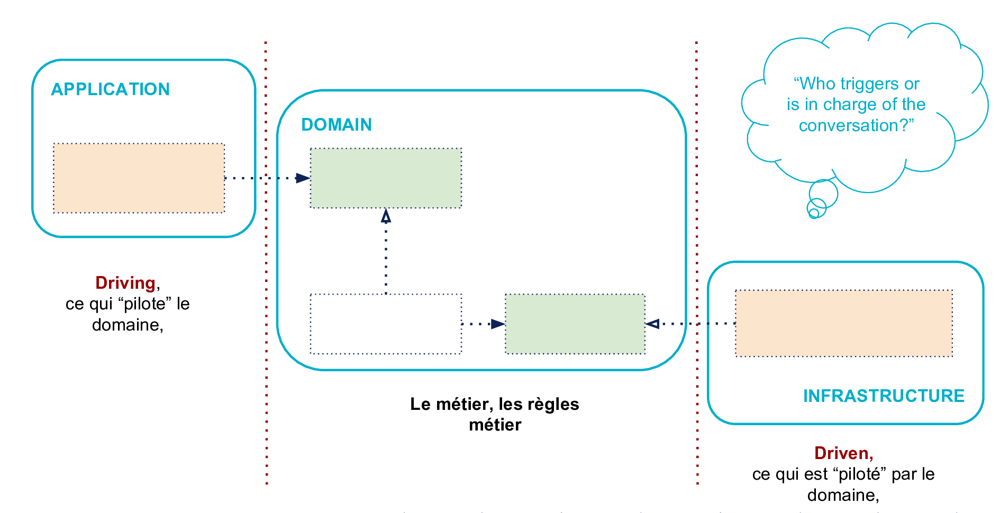
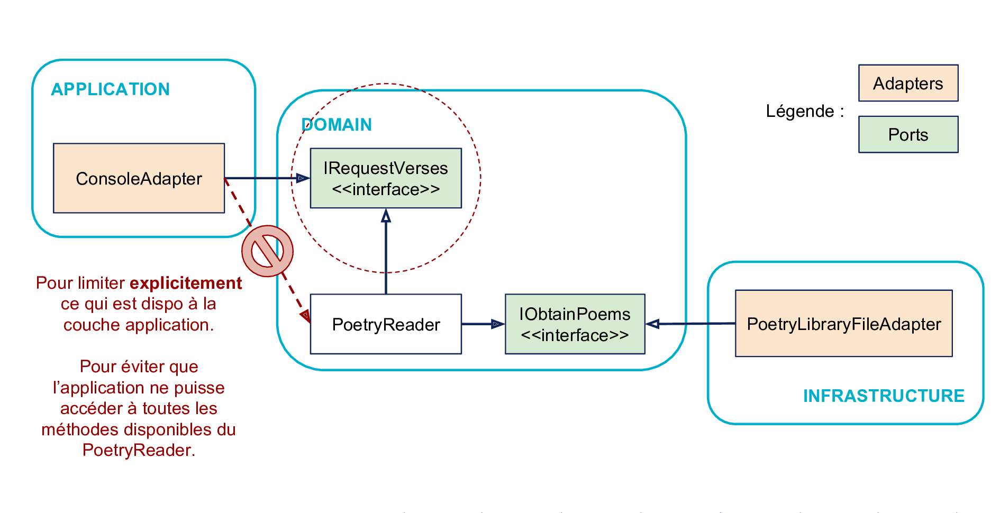

# Clean Code


---

## Origines

Robert C. Martin (Uncle Bob)


https://blog.cleancoder.com/

https://cleancoders.com/videos

---

### Clean Code: A Handbook of Agile Software Craftsmanship

<small>Paru en 2008</small>


---

### Extreme Programming – 1999

<small>Kent Beck, Ward Cunningham, Ron Jeffries</small>

http://www.extremeprogramming.org/

- Communication
- Simplicité
- Retour d'information (_Feedback_)
- Courage
- Respect

---

### Agile Manifesto – 2001

https://agilemanifesto.org/

1. **Les individus et leurs interactions**
   <br/><small>plus que les processus et les outils</small>
2. **Des logiciels opérationnels**
   <br/><small>plus qu’une documentation exhaustive</small>
3. **La collaboration avec les clients**
   <br/><small>plus que la négociation contractuelle</small>
4. **L’adaptation au changement**
   <br/><small>plus que le suivi d’un plan</small>

---

### Software Craftsmanship – 2009

https://manifesto.softwarecraftsmanship.org/

- Pas seulement des logiciels opérationnels,
  mais aussi **des logiciels bien conçus**
- Pas seulement l'adaptation aux changements,
  mais aussi **l'ajout constant de la valeur**
- Pas seulement les individus et leurs interactions,
  mais aussi **une communauté de professionnels**
- Pas seulement la collaboration avec les clients,
  mais aussi **des partenariats productifs**

Note: Réaction aux pratiques dites "agiles" qui dominent l'industrie mais qui selon les signataires originels s'éloignent des principes fondateurs de l'agilité

Faire de l'agile vs. être agile, pratiquer l'agilité

---

## Principes

---

### Acronymes

#### DRY

Dont' Repeat Yourself

#### KISS

Keep It Simple, Stupid

#### YAGNI

You Ain't Gonna Need It

#### POLA

Principle Of Least Astonishment

---

### Simple Design

#### Les quatre principes de Kent Beck

1. Les tests réussissent
2. Le code exprime l'intention (doit être facile à comprendre)
3. Pas de duplication
4. Le moins d'éléments possible

Note:

Principes par ordre de priorité

2. POLA
3. DRY
4. KISS, YAGNI

---

### SOLID

#### Les cinq principes du code robuste

<small>Robert C. Martin, Michael Feathers</small>

- **S**ingle responsibility
- **O**pen–closed
- **L**iskov substitution
- **I**nterface segregation
- **D**ependency inversion

===

#### Single responsibility

Responsabilité unique&nbsp;: une entité applicative (classe, fonction, module ...) doit avoir une et une seule responsabilité

> "A class should have only one reason to change" — Robert C. Martin

https://blog.cleancoder.com/uncle-bob/2014/05/08/SingleReponsibilityPrinciple.html

Note: Éviter le code monolithique et les couplages forts,

KISS, YAGNI

===

#### Open–closed

Ouvert/fermé&nbsp;: une entité applicative (classe, fonction, module ...) doit être ouverte à l'extension, mais fermée à la modification

- Une classe doit pouvoir être étendue par dérivation ou délégation
- Une fois une classe approuvée, son code source ne doit plus pouvoir être modifié

Note: Encourage les abstractions et la réutilisabilité (confiance dans l'existant)

POLA, YAGNI, DRY

===

#### Liskov substitution

Substitution de Liskov&nbsp;: si _S_ est un sous-type de _T_, alors tout objet de type _T_ peut être remplacé par un objet de type _S_ sans altérer les propriétés du programme

Note: Similaire à la programmation par contrat

Une sous-classe ne doit pas modifier le comportement attendu de sa classe de base

POLA, DRY

===

#### Interface segregation

Ségrégation des interfaces&nbsp;: préférer plusieurs interfaces spécifiques pour chaque client plutôt qu'une seule interface générale

Aucun client ne devrait avoir à dépendre d'interfaces dont il n'a pas besoin

Note: Encourage le découplage, par exemple IHM et logique métier

Architecture hexagonale

YAGNI, KISS

===

#### Dependency inversion

Inversion des dépendances&nbsp;: il faut dépendre des abstractions, pas de leurs réalisations (implémentations)

1. Les modules de haut niveau ne doivent pas dépendre des modules de bas niveau. Les deux doivent dépendre d'abstractions.
2. Les abstractions ne doivent pas dépendre des détails. Les détails doivent dépendre des abstractions.

Note: Architecture hexagonale

Améliore la testabilité (mocks) et le découplage des couches

POLA, KISS

---

## Pratiques

---

### Pratiques de conception

---

#### DDD

_Domain-Driven Design_

- Contexte : périmètre dans lequel un mot ou une phrase a une signification
- Domaine : sphère d'un métier ou activité pour lequel on développe l'application
- Modèle : abstraction qui décrit certains concepts d'un domaine pour en résoudre les problèmes liés
- _Ubiquitous language_, langage omniprésent : langage structuré autour du modèle du domaine et utilisé par tous les membres de l'équipe

Note: Bien nommer les choses en rapport avec le domaine métier

---

#### Architecture hexagonale

<small>Alistair Cockburn</small>


<small>https://blog.octo.com/architecture-hexagonale-trois-principes-et-un-exemple-dimplementation</small>

Note: Application direct des principes I et D de SOLID

Permettre à une application d’être pilotée aussi bien par des utilisateurs que par des programmes, des tests automatisés ou des scripts batchs, et d’être développée et testée en isolation de ses éventuels systèmes d’exécution et bases de données.

===

<!-- .slide: data-transition="fade" -->

Séparer Application, Domaine et Infrastructure


===

<!-- .slide: data-transition="fade" -->

Qui pilote qui ?



===

<!-- .slide: data-transition="fade" -->

Intérieur/Extérieur


===

<!-- .slide: data-transition="fade" -->

On isole les frontières par des interfaces


===

<!-- .slide: data-transition="fade" -->

Les dépendances vont vers l’intérieur


===

<!-- .slide: data-transition="fade" -->

Ports & Adaptateurs


===

<!-- .slide: data-transition="fade" -->

Ségrégation des Interfaces à gauche



===

<!-- .slide: data-transition="fade" -->

Inversion de Dépendances à droite


===

<!-- .slide: data-transition="fade" -->

Inversion de Dépendances à droite


===

<!-- .slide: data-transition="fade" -->

Tests : côté Application


===

<!-- .slide: data-transition="fade" -->

Tests : côté Infrastructure


---

### Pratiques de développement

---

#### Refactoring

Refactoring = "réusinage", restructuration

https://refactoring.com/catalog/

Note: Refactoring ≠ (re)factorisation

Mais factorisation peut faire partie du refactoring

---

#### TDD

<small>Kent Beck</small>

_Test-Driven Development_

Pratique issue de l'XP

1. Ajouter un nouveau test
2. S'assurer que le nouveau test échoue
3. Écrire/refactorer le code
4. Exécuter à nouveau les tests
5. Répéter 3-4 jusqu'à ce que tous les tests réussissent

---

#### BDD

<small>Dan North</small>

_Behavior-Driven Development_

Evolution du TDD centré sur le domaine métier et la création de valeur

- Récit utilisateur (User Story)
- Scénarios
- Exigences et critères d'acceptation

https://dannorth.net/introducing-bdd/

---

### Pratiques de codage

---

#### Object Calisthenics

<small>Jeff Bay</small>

Callisthénie&nbsp;: du grec κάλλος (beauté) + σθένος (force), exercices de gymnastique visant à l'amélioration des capacités physiques et de l'esthétique du corps

===

https://www.slideshare.net/rdohms/object-calisthenicstek13

<iframe src="//www.slideshare.net/slideshow/embed_code/key/AvRtTds60JVHSV" width="595" height="485" frameborder="0" marginwidth="0" marginheight="0" scrolling="no" style="border:1px solid #CCC; border-width:1px; margin-bottom:5px; max-width: 100%;" allowfullscreen> </iframe>

---

##### 9 principes de bases

1. Un niveau d'indentation par méthode
2. Ne pas utiliser le mot-clé **else**
3. Emballer tous les types primitifs et les chaînes dans des classes
4. Les collections sont des classes de premier ordre
5. Une indirection par ligne
6. Ne pas utiliser d'abréviation
7. Limiter la longueur des entités (classes, méthodes...)
8. Pas plus de deux variables d'instance par classe
9. Pas d'accesseurs

---

##### 1. Un niveau d'indentation par méthode


===

<!-- .slide: data-transition="fade" -->

```csharp
int TotalPrice(List<Product> products) {
    int price = 0;
    foreach (Product product in products) {
        if (product.Weight > 0) {
            price += product.Weight * product.PriceWeight;
        } else {
            price += product.Quantity * product.PriceUnit;
        }
    }
    return price;
}
```

===

<!-- .slide: data-transition="fade" -->

Extract Function

```csharp
int TotalPrice(List<Product> products) {
    int price = 0;
    foreach (Product product in products) {
        price += ProductPrice(product);
    }
    return price;
}

int ProductPrice(Product product) {
    if (product.Weight > 0) {
        return product.Weight * product.PriceWeight;
    } else {
        return product.Quantity * product.PriceUnit;
    }
}
```

---

##### 2. Ne pas utiliser le mot-clé **else**


===

<!-- .slide: data-transition="fade" -->

```csharp
void DoSomeStuff() {
    if (EverythingIsFine()) {
        // ... 200 lines of code
    } else {
        throw new SomeException();
    }
}
```

===

Replace Nested Conditional with Guard Clauses

<!-- .slide: data-transition="fade" -->

```csharp
void DoSomeStuff() {
    if (!EverythingIsFine()) throw new SomeException();

    // ... 200 lines of code
}
```

===

Replace Nested Conditional with Guard Clauses + Extract Function

<!-- .slide: data-transition="fade" -->

```csharp
void DoSomeStuff() {
    CheckEverythingIsFine()

    // ... 200 lines of code
}

void CheckEverythingIsFine() {
    if (!EverythingIsFine()) throw new SomeException();
}
```

---

##### 3. Emballer tous les types primitifs et les chaînes dans des classes

DDD&nbsp;: Value Object

Si une valeur a un comportement particulier dans le domaine métier, celle-ci doit être encapsulée

===

<!-- .slide: data-transition="fade" -->

Exemple 1 : Type primitif comme Value Object

```csharp
class Product {
    float PriceUnit;
    // ...

    static int ComparePrice(Product p1, Product p2) {
        if (p1.PriceUnit < p2.PriceUnit) return -1;
        else if (p1.PriceUnit > p2.PriceUnit) return 1;
        else 0;
    }
}
```

===

<!-- .slide: data-transition="fade" -->

Replace Primitive with Object

```csharp
class Product {
    Price PriceUnit;
    // ...

    static int ComparePrice(Product p1, Product p2) {
        return p1.PriceUnit.Compare(p2.PriceUnit);
    }
}

class Price {
    float Value;

    static int Compare(Price p1, Price p2) {
        if (p1.Value < p2.Value) return -1;
        else if (p1.Value > p2.Value) return 1;
        else return 0;
    }
}
```

===

<!-- .slide: data-transition="slide-in fade-out" -->

Exemple 2 : Typage faible

```csharp
class Product {
    int ProductId;
    int SupplierId;
    // ...
}

Product p;
p.ProductId = p.SupplierId; // BUG
```

===

<!-- .slide: data-transition="fade" -->

Typage fort

```csharp
class ProductId {
    int Id;
}
class SupplierId {
    int Id;
}
class Product {
    ProductId _ProductId;
    SupplierId _SupplierId;
    // ...
}

Product p;
p._ProductId = p._SupplierId; // Erreur de compilation
```

---

##### 4. Les collections sont des classes de premier ordre

Toute classe contenant une collection ne doit contenir aucune autre variable d'instance.

Si vous avez un ensemble d'élément et que vous voulez les manipuler, créez une classe dédiée.

===

<!-- .slide: data-transition="fade" -->

```csharp
class Package {
    List<Product> Products;
    // ...

    List<Product> GetProductsByPrice() {
        return Products.OrderBy(p => p.PriceUnit);
    }
}
```

===

<!-- .slide: data-transition="fade" -->

Extract Class / Encapsulate Collection

```csharp
class ProductList {
    List<Product> Elements;

    ProductList OrderByPrice() {
        return new ProductList {
            Elements = this.Elements.OrderBy(p => p.PriceUnit)
        };
    }
}

class Package {
    ProductList Products;
    // ...

    ProductList GetProductsByPrice() {
        return Products.OrderByPrice();
    }
}
```

---

##### 5. Une indirection par ligne

Loi de Demeter&nbsp;: « Ne parlez qu'à vos amis immédiats »

Le chaînage doit être limité à un seul contexte

===

<!-- .slide: data-transition="fade" -->

```csharp
class Package {
    ProductList Products;
    // ...

    Price GetCheapestProductPrice() {
        return Products.OrderByPrice().First().PriceUnit;
    }
}
```

===

<!-- .slide: data-transition="fade" -->

Extract Variable

```csharp
class Package {
    ProductList Products;
    // ...

    Price GetCheapestProductPrice() {
        // OK: interface fluide
        Product cheapest = Products
            .OrderByPrice()
            .First();

        return cheapest.PriceUnit;
    }
}
```

---

##### 6. Ne pas utiliser d'abréviation

Si abbréviation il y a, elle doit être utilisée partout et de façon cohérente dans le cadre du domaine métier

Un identifiant trop long est souvent le signe d'une violation des principes SOLID

Note: Eviter les ambiguités

Dépend du langage, des conventions de nommage, du domaine

---

##### 7. Limiter la longueur des entités (classes, méthodes...)

Une fonction doit idéalement tenir sur une seule page

Un code trop long est le signe qu'il faut refactorer

---

##### 8. Pas plus de deux variables d'instance par classe

Principe de responsabilité unique&nbsp;: S de SOLID

Note: Eviter le couplage fort

---

##### 9. Pas d'accesseurs

"Tell, don't ask"

> "Procedural code gets information then makes decisions. Object-oriented code tells objects to do things." — Alec Sharp

Les accesseurs violent le O de SOLID&nbsp;: Open/Closed principle

Coder le comportement via des méthodes plutôt que des propriétés

Note: Eviter les violations d'abstraction

Dépend du langage (JavaBeans)

===

<!-- .slide: data-transition="fade" -->

```csharp
class Package {
    ProductList Products { get ; set };
    public int MaxProducts;
    // ...
}

Package package;
Product product;
if (package.Products.Count < package.MaxProducts) {
    package.Products.Add(product);
} else {
    throw PackageFullException();
}
```

===

<!-- .slide: data-transition="fade" -->

Extract Function

```csharp
class Package {
    ProductList Products;
    int MaxProducts;
    // ...
    void AddProduct(Product product) {
        if (Products.Count >= MaxProducts)
            throw PackageFullException();

        Products.Add(product);
    }
}

Package package;
Product product;
package.AddProduct(product);
```

---

#### Les commentaires

Plusieurs écoles s'affrontent&nbsp;:

- Les commentaires sont obligatoires en toutes circonstances
- Les commentaires sont inutiles et dangereux en toutes circonstances
- Les commentaires sont parfois nécessaires selon les circonstances

---

##### Les commentaires sont obligatoires en toutes circonstances

"École de la qualimétrie"

Avis dominant dans l'informatique d'entreprise

Conception dépassée de la qualité logicielle&nbsp;:

- Critère qualitatif et non quantitatif
- Frein à la productivité
- Dette documentaire
- Contredit par toutes les études

---

##### Les commentaires sont inutiles et dangereux en toutes circonstances

"École puriste"

Avis dominant dans les communautés XP (Extreme Programming) et TDD

- Le code doit être suffisamment explicite pour se passer de commentaires (code auto-documenté)
- Le code vit, les commentaires pourrissent
- Les tests sont une forme de documentation

---

##### Les commentaires sont parfois nécessaires selon les circonstances

"École pragmatique"

En accord dans l'ensemble avec l'école puriste

MAIS

Commentaires utiles voire nécessaires quand les bonnes pratiques de codage montrent leurs limites

> Le code dit comment, mais le commentaire doit dire pourquoi

---

##### Writing system software: code comments

<small>Salvatore Sanfilippo "Antirez" (auteur de Redis)</small>

http://antirez.com/news/124

https://lucas.bourneuf.net/blog/antirez-commentaires.html

===

##### 9 types de commentaires

1. Commentaires de fonction (_Function comments_)
2. Commentaires de conception (_Design comments_)
3. Commentaires _pourquoi_ (_Why comments_)
4. Commentaires d'enseignant (_Teacher comments_)
5. Commentaires check-list (_Checklist comments_)
6. Commentaires guides (_Guide comments_)
7. Commentaires triviaux (_Trivial comments_)
8. Commentaires de dette (_Debt comments_)
9. Commentaires de sauvegarde (_Backup comments_)

===

##### 1. Commentaires de fonction

"Cartouche"

- Aide à la navigation du source
- Évite d'avoir à lire le code
- Peut être redondant avec le nom de la fonction
- Utilisé par les IDE et les générateurs de documentation

```csharp
/// <summary>
/// Add product to package if not full
/// </summary>
/// <param name="product">Product to add</param>
/// <exception cref="PackageFullException">Package is full</exception>
void AddProduct(Product product) {
```

===

##### 2. Commentaires de conception

- Souvent situé en tête de module
- Explique pourquoi et comment le code est structuré
- Justifie les choix d'algorithme, de structure de données...

Alternative&nbsp;: Architectural Decision Records (ADR)

```csharp
/// <summary>
/// This class implements a job queue using a simple bucket queue.
/// Other implementations give better theoretical results, however
/// bucket queues are sufficient for our domain size.
/// </summary>
namespace JobQueue {
```

===

##### 3. Commentaires _pourquoi_

- Expliquer les raisons derrière un code évident
- Quand refactorer pour rendre le commentaire inutile ne fera que déplacer la complexité

```csharp
// Warning: input index is one-based
Product product = Products[index-1];
```

===

##### 4. Commentaires d'enseignant

- Ne portent pas sur le code lui-même mais sur le domaine dans lequel le code opère (mathématiques, physique, structures de données...)

```csharp
// We need the sum of all integers between 1 and n. This is simply
// given by the formula:
//
//    n      n × (n + 1)
//   Σ k  =  -----------
//   k=1          2
//
// See:
// https://en.wikipedia.org/wiki/1_%2B_2_%2B_3_%2B_4_%2B_%E2%8B%AF
int sum = n * (n+1) / 2;

```

===

##### 5. Commentaires check-list

- Rappeler un ensemble d'actions à effectuer si le code est modifié
- Indiquer comment certains changements doivent être opérés

```cpp
Thing * createThing() {
    // Warning: we use malloc/free and not new/delete, make sure to
    // keep both createThing and deleteThing in sync
    return (Thing *) malloc(sizeof(Thing));
}
void deleteThing(Thing *thing) {
    // Warning: we use malloc/free and not new/delete, make sure to
    // keep both createThing and deleteThing in sync
    free(thing);
}
```

===

##### 6. Commentaires guides

- Assister le lecteur dans la lecture du code&nbsp;: sections, rythme, introduction...
- Diminuer la charge mentale
- Guider les modifications futures&nbsp;: un ajout sera plus sûrement rajouté dans la section appropriée

```csharp
// Try to find a big enough package for all products
Package package = FindPackage(products);
if (package != null) return package

// If none found, fit as many products as possible in the largest
// available package
ProductList remainingProducts;
package = FindBestPackage(products, out remainingProducts);
```

===

##### 7. Commentaires triviaux

- Décrit litéralement ce que fait le code sans expliquer pourquoi
- La charge mentale est la même pour le code et le commentaire
- A éviter à tout prix

```csharp
// Get product at index minus one
Product product = Products[index-1];
```

===

##### 8. Commentaires de dette

- Dette technique explicitement indiquée dans le code&nbsp;: FIXME, TODO, etc
- En général pas souhaitable (préférer les commentaires de conception)
- Utile pour indiquer les compromis qui répondent au besoin actuel mais sur lesquels on est susceptible de revenir en cas d'évolution future (YAGNI, KISS etc)

```csharp
// FIXME: Use a simple linked list because we expect it to be short,
// replace by a more appropriate data structure if needed
```

===

##### 9. Commentaires de sauvegarde

- Vieux code conservé par prudence à côté du nouveau
- Pratique dépassée, la gestion de configuration et les branches sont faites pour ça

---

## Application au code historique

---

### Code Smells, Design Smells

> "Design smells are the odors of rotting software." — Robert C. Martin

Signaux présents dans le code ou la conception, symptomes probables de mauvaise qualité logicielle

<small>

- Constantes en dur
- Code dupliqué
- Niveaux d'indentation
- Longueur d'une classe, d'une fonction
- Nombre de paramètres d'une fonction
- Singletons, "Objet Dieu"
- Usage excessif des Design Patterns
- Etc.

</small>

===

- http://wiki.c2.com/?CodeSmell

- https://c2.com/cgi/fullSearch?search=CategoryCodeSmell

- https://blog.codinghorror.com/code-smells/

---

### Stratégie de tests

Les tests existants sont souvent insuffisants pour assurer un refactoring isofonctionnel

- Mettre en place des tests supplémentaires ou ciblés
- N'utiliser que des techniques de refactoring "sures" : extraction de fonctions par exemple
- Respecter la pyramide des tests

===

[CFTL](http://www.cftl.fr/) : Comité Français des Tests Logiciels


---

### Documentation

Le code historique s'accompagne souvent d'un support documentaire insuffisant ou inexistant

- Documentation obsolète voire trompeuse
- Absence d'historique
- Commentaires absents ou insuffisants
- Conventions de nommage incohérentes, méconnaissance du domaine métier

**L'approche Clean Code doit être incrémentale et en synergie avec l'approche documentaire**

---

#### Documentation classique

Le code et la documentation sont maintenus séparément avec des outils différents

- Fichiers texte (README, ...)
- Document structuré (Word, HTML, ...)
- Base de connaissances (Confluence, MediaWiki, ...)
- Etc.

---

#### Documentation as code

La documentation est écrite, générée, testée, versionnée avec le code et/ou comme du code

- Doxygen, Javadoc, XML comments, ...
- User stories, Gherkin
- Markdown, Ascidoc
- Etc.

---

#### Living documentation

_Documentation as code_, mais le code est la source de la documentation

- Génération statique&nbsp;: Doxygen, Javadoc, DocFX, etc.
- Génération dynamique&nbsp;: les résultats de l'exécution du code et des tests sont intégrés à la documentation

===

Cyrille Martraire

<small>Paru en 2017</small>


https://github.com/cyriux/livingdocumentation-thebook

---

## Coding dojo
